# FishGfx

FishGfx is a Windows-first C# graphics and game-framework library built on OpenGL 4, GLFW, and Silk.NET. The modern core targets .NET 10 and includes immediate 2D primitives, GPU resource abstractions, bitmap and SDF text, retained drawables, reflected function-node graphs, and interactive validation applications.

- [Architecture and project information](INFO.md)
- [Bug history](BUGS.md)

## Supported configuration

- Windows x64
- .NET 10 SDK
- OpenGL 4.0–4.6 core profile
- Silk.NET.OpenGL 2.23.0
- The bundled native `glfw3.dll`
- `System.Drawing.Common` for the current Windows bitmap APIs

The core tries OpenGL 4.6 first and falls back version-by-version to 4.0. OpenGL 4.5 and newer use Direct State Access where available; older contexts use bind-to-edit fallbacks.

## Build and run

```powershell
dotnet restore FishGfx.Modern.sln
dotnet build FishGfx.Modern.sln -c Debug
dotnet test FishGfx.Modern.sln -c Debug
dotnet run --project FishGfx.SmokeTest/FishGfx.SmokeTest.csproj
dotnet run --project FishGfx.NodeEditor/FishGfx.NodeEditor.csproj
```

`FishGfx.Modern.sln` contains the supported modern projects:

- `FishGfx`: core rendering, windowing, input, formats, fonts, and node-graph APIs.
- `FishGfx.SmokeTest`: interactive primitive gallery and automated screenshot validation.
- `FishGfx.NodeEditor`: reflected C# function-node editor with evaluation and JSON persistence.
- `FishGfx.Tests`: context-free geometry, font, node-graph, persistence, and compatibility tests.

The older demos, tools, LiteTest, and Nuklear projects remain outside the modern solution pending separate migrations. Intel RealSense support and its test project have been removed.

## Capabilities

### Rendering and resources

- Automatic OpenGL 4.0–4.6 context creation through the custom GLFW binding.
- Silk.NET-backed shaders, buffers, vertex arrays, textures, framebuffers, render textures, queries, and render state.
- Context-thread GPU creation and deferred destruction of finalizer-released resources.
- Cameras, 2D and 3D meshes, terrain, models, sprites, tile maps, and parallax sprites.
- Alpha blending, depth/cull/color state, scissor regions, stencil functions/operations, and framebuffer depth-stencil attachments.
- Windows bitmap texture loading, readback, and deterministic gallery screenshots.

### Immediate 2D primitives

- Points, thick lines, and line strips.
- Filled, outlined, and textured rectangles.
- Filled, outlined, and textured rounded rectangles with asymmetric corner radii.
- Stretched nine-patch textures with source-pixel borders.
- Filled, outlined, and textured circles and ellipses.
- Filled rings and outlined annular sectors.
- Stroked quadratic and cubic Bézier curves.

All filled tessellated primitives use a single streaming-mesh upload and draw call per shape. Adaptive segment counts are available where appropriate, with explicit overrides for visual testing.

### Typed command lists

`CommandList` records inspectable, immutable `GraphicsCommand` objects and can replay them repeatedly on the active graphics-context thread. Mutable point and vertex arrays are copied at record time. Textures, shaders, and fonts are retained as caller-owned references and must remain valid through every replay. Camera, model transform, and `ShaderUniforms.Current` values are resolved when `Execute` runs.

```csharp
CommandList commands = new CommandList();
commands.RecordPushRenderState(Gfx.PeekRenderState());
commands.RecordFilledCircle(new Vector2(320, 240), 80, Color.CornflowerBlue);
commands.RecordDrawText(font, new Vector2(230, 120), "replay me", Color.White, 32);
commands.RecordPopRenderState();

commands.Execute();
```

Successful execution preserves every command. Replay stops at the first exception and resets `IsExecuting`, but earlier graphics or render-stack changes are not rolled back. Lists do not provide internal synchronization and cannot be mutated or executed recursively during replay.

### Fonts and console

FishGfx supports binary AngelCode BMFont atlases and scalable SDF text generated from TrueType files:

```csharp
using FishGfx;
using FishGfx.Formats;
using FishGfx.Graphics;

using TTFFont font = new TTFFont("data/fonts/Aaargh.ttf");
Gfx.DrawText(font, new Vector2(100, 100), "Smooth SDF text", Color.White, 64);
```

`TTFFont` preloads printable ASCII and lazily adds Unicode BMP glyphs to a growable atlas. Layout supports multiline text, tabs, pair kerning, scaling, measurement, color, and alpha. Complex shaping, combining-mark handling, right-to-left layout, and supplementary Unicode planes are not supported yet.

The smoke gallery also integrates the tile/text-based developer console. Press F1 to toggle it and use `help` to list gallery commands.

### Function node graphs

Public static methods marked with `[NodeFunction]` become placeable, strongly typed graph nodes. Ordinary parameters become input ports, return values become outputs, and `[NodeBody]` parameters become inline editable values.

```csharp
using FishGfx.NodeGraph;

static class MathNodes
{
	[NodeFunction("Constant", Category = "Values")]
	public static float Constant([NodeBody] float value = 1) => value;

	[NodeFunction(Category = "Math")]
	public static float Add(float a, float b) => a + b;
}

NodeFunctionRegistry registry = new NodeFunctionRegistry();
registry.Register(typeof(MathNodes));
```

Connections require exact CLR type equality. Inputs accept one connection, outputs support fan-out, and evaluation runs in topological order while reporting cycles, invocation errors, and skipped dependents. Named `ValueTuple` returns are expanded into multiple outputs.

Layouts and canvas state can be saved and loaded through `NodeGraphJson`. The bundled editor uses Ctrl+S and Ctrl+O with `node-layout.json` beside the executable. A saved graph can also execute without creating an OpenGL window:

```powershell
dotnet FishGfx.NodeEditor.dll --execute node-layout.json
```

## Automated gallery screenshots

Run the complete primitive gallery unattended with:

```powershell
dotnet run --project FishGfx.SmokeTest/FishGfx.SmokeTest.csproj -- --auto
```

Automatic mode uses a fixed animation time, captures each complete 1920×1080 scene, and atomically overwrites its PNG under `FishGfx/pictures`. It also generates 640×360 documentation thumbnails under `FishGfx/pictures/thumbnails`.

## Roadmap

### Near term

- Complete stencil write-mask support and add focused scissor/stencil gallery scenes and tests.
- Implement SMD saving and define graceful handling for unsupported SMD parser segments.
- Expand OpenGL 4.0 fallback and render-state compatibility coverage.

### Later

- Add advanced text shaping, combining-mark handling, right-to-left layout, and supplementary Unicode support.
- Add a general 2D path/stroke API with configurable joins, caps, arcs, and filled paths.
- Add node-editor undo/redo, grouping, clipboard operations, and multi-selection.
- Replace Windows-only bitmap dependencies as part of broader platform support.

### Deferred migrations

- Migrate the legacy demos, model converter, VectorPFM, LiteTest, and Nuklear integration to .NET 10.
- Re-evaluate retained legacy APIs and remove obsolete compatibility code after those migrations.

## Gallery

The 640×360 thumbnails below include the selected scene in the left-side menu. Select a thumbnail to open its full 1920×1080 capture.

| **Gfx.Line** | **Gfx.Rectangle** | **Gfx.FilledRectangle** |
|:---:|:---:|:---:|
| [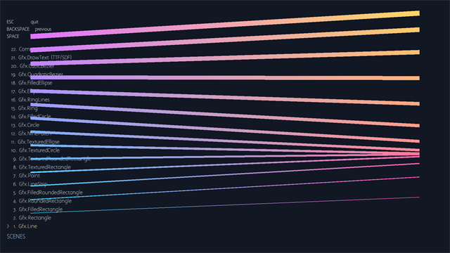](FishGfx/pictures/gfx-line.png) | [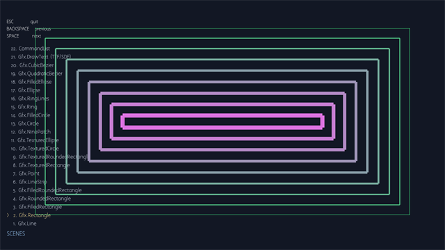](FishGfx/pictures/gfx-rectangle.png) | [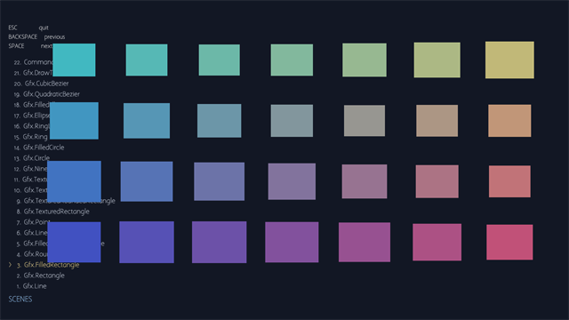](FishGfx/pictures/gfx-filledrectangle.png) |
| **Gfx.RoundedRectangle** | **Gfx.FilledRoundedRectangle** | **Gfx.LineStrip** |
| [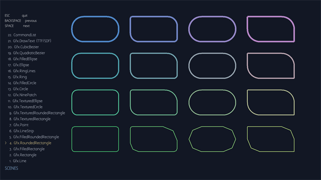](FishGfx/pictures/gfx-roundedrectangle.png) | [](FishGfx/pictures/gfx-filledroundedrectangle.png) | [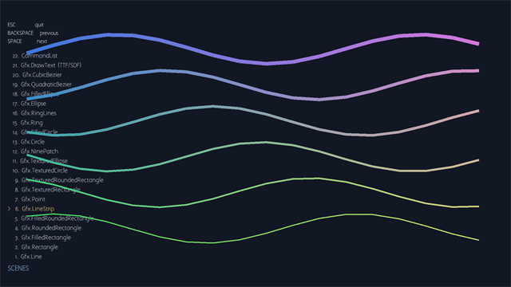](FishGfx/pictures/gfx-linestrip.png) |
| **Gfx.Point** | **Gfx.TexturedRectangle** | **Gfx.TexturedRoundedRectangle** |
| [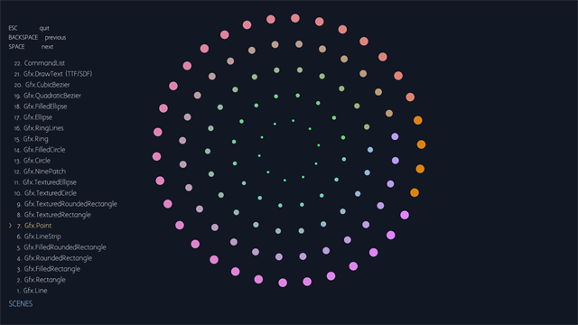](FishGfx/pictures/gfx-point.png) | [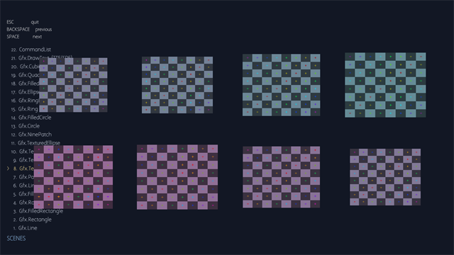](FishGfx/pictures/gfx-texturedrectangle.png) | [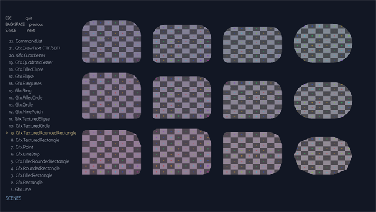](FishGfx/pictures/gfx-texturedroundedrectangle.png) |
| **Gfx.TexturedCircle** | **Gfx.TexturedEllipse** | **Gfx.NinePatch** |
| [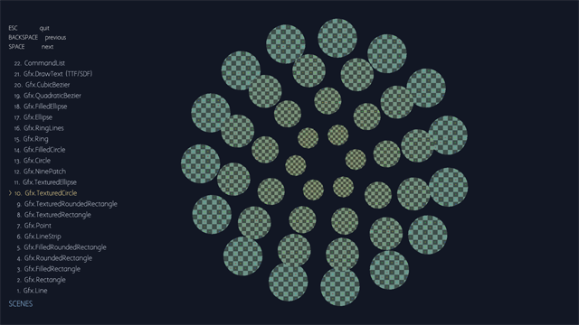](FishGfx/pictures/gfx-texturedcircle.png) | [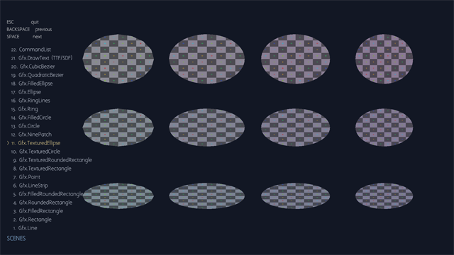](FishGfx/pictures/gfx-texturedellipse.png) | [](FishGfx/pictures/gfx-ninepatch.png) |
| **Gfx.Circle** | **Gfx.FilledCircle** | **Gfx.Ring** |
| [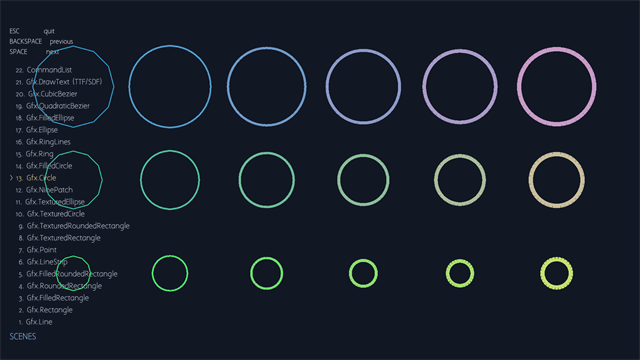](FishGfx/pictures/gfx-circle.png) | [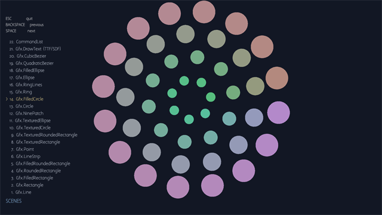](FishGfx/pictures/gfx-filledcircle.png) | [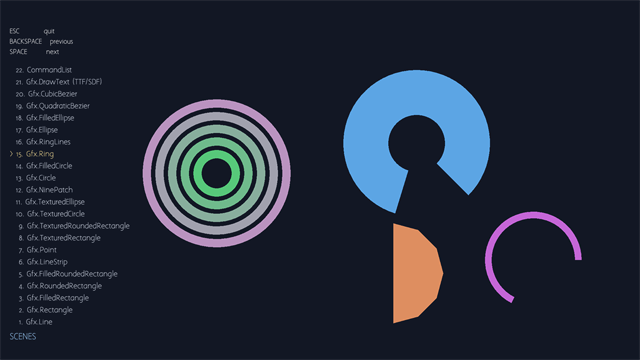](FishGfx/pictures/gfx-ring.png) |
| **Gfx.RingLines** | **Gfx.Ellipse** | **Gfx.FilledEllipse** |
| [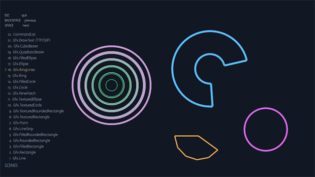](FishGfx/pictures/gfx-ringlines.png) | [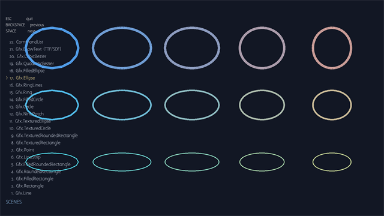](FishGfx/pictures/gfx-ellipse.png) | [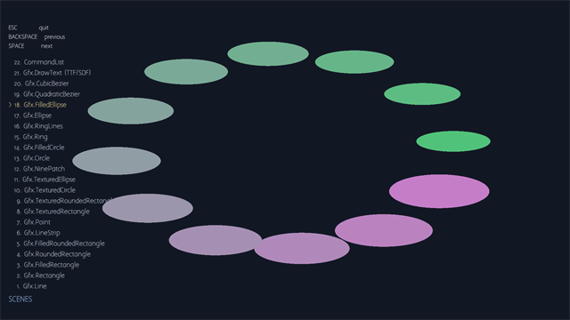](FishGfx/pictures/gfx-filledellipse.png) |
| **Gfx.QuadraticBezier** | **Gfx.CubicBezier** | **Gfx.DrawText (TTF/SDF)** |
| [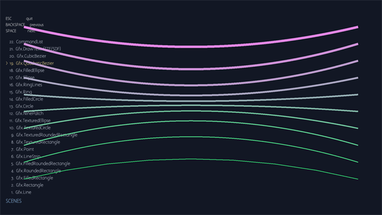](FishGfx/pictures/gfx-quadraticbezier.png) | [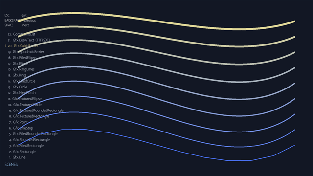](FishGfx/pictures/gfx-cubicbezier.png) | [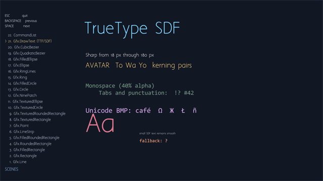](FishGfx/pictures/gfx-drawtext-ttf-sdf.png) |
| **CommandList** |  |  |
| [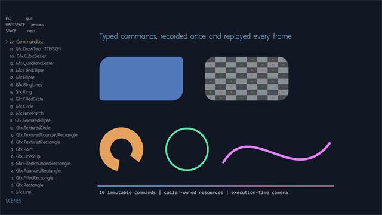](FishGfx/pictures/commandlist.png) |  |  |
