# FishGfx

FishGfx is a Windows-first C# graphics and game-framework library built on OpenGL 4, GLFW, and Silk.NET. The modern core targets .NET 10 and includes immediate 2D primitives, GPU resource abstractions, bitmap and SDF text, retained drawables, editable voxel chunks, reflected function-node graphs, and interactive validation applications.

- [Architecture and project information](INFO.md)
- [Graphics API and resource contract](GRAPHICS_API.md)
- [Bug history](BUGS.md)

## Supported configuration

- Windows x64
- .NET 10 SDK
- OpenGL 4.0–4.6 core profile
- Silk.NET.OpenGL 2.23.0
- The bundled native `glfw3.dll`
- `System.Drawing.Common` for the current Windows bitmap APIs

The core tries OpenGL 4.6 first and falls back version-by-version to 4.0. OpenGL 4.5 and newer use Direct State Access where available; older contexts use bind-to-edit fallbacks.

## Build and run

Clone with submodules, or initialize them before restoring:

```powershell
git clone --recurse-submodules https://github.com/sbarisic/FishGfx.git
# Existing checkout:
git submodule update --init --recursive
```

```powershell
dotnet restore FishGfx.Modern.sln
dotnet build FishGfx.Modern.sln -c Debug
dotnet test FishGfx.Modern.sln -c Debug
dotnet run --project FishGfx.SmokeTest/FishGfx.SmokeTest.csproj
dotnet run --project FishGfx.NodeEditor/FishGfx.NodeEditor.csproj
dotnet run --project FishGfx.VoxelTest/FishGfx.VoxelTest.csproj
```

`FishGfx.Modern.sln` contains the supported modern projects:

- `FishGfx`: core rendering, windowing, input, formats, fonts, and node-graph APIs.
- `FishGfx.FishUI`: reusable FishUI graphics, input, and rooted-file-system adapters.
- `FishGfx.SmokeTest`: interactive primitive gallery and automated screenshot validation.
- `FishGfx.NodeEditor`: reflected C# function-node editor with evaluation and JSON persistence.
- `FishGfx.VoxelTest`: editable, multi-chunk voxel-rendering validation application.
- `FishGfx.Tests`: context-free geometry, font, node-graph, persistence, and compatibility tests.

The older demos, tools, LiteTest, and Nuklear projects remain outside the modern solution pending separate migrations. Intel RealSense support and its test project have been removed.

## Capabilities

### Rendering and resources

- Automatic OpenGL 4.0–4.6 context creation through the custom GLFW binding.
- Silk.NET-backed shaders, buffers, vertex arrays, textures, render targets, queries, and render state.
- Context-thread GPU creation and deferred destruction of finalizer-released resources.
- Cameras, 2D and 3D meshes, terrain, models, sprites, tile maps, and parallax sprites.
- Alpha blending, depth/cull/color state, scissor regions, stencil functions/operations, and framebuffer depth-stencil attachments.
- Windows bitmap texture loading and deterministic framebuffer screenshots.

### Stateful rendering

`RenderWindow.Graphics` is the primary rendering API. Its `GraphicsContext` owns per-context render state, pass-uniform infrastructure, immediate-renderer meshes and shaders, resource deletion, capabilities, and the backbuffer. A frame contains ordered render passes, and presentation is explicit:

```csharp
using RenderWindow window = new(new RenderWindowOptions
{
	Width = 1280,
	Height = 720,
	Title = "FishGfx",
	MinimumVersion = new OpenGlVersion(4, 0),
});

GraphicsContext graphics = window.Graphics;
Camera camera = new();
camera.SetOrthogonal(0, 0, window.Width, window.Height);

using RenderFrame frame = graphics.BeginFrame();
using (RenderPass pass = frame.BeginPass(graphics.Backbuffer, new RenderPassDescriptor
{
	View = new RenderView(camera),
	State = RenderState.Default,
	ColorLoadAction = RenderLoadAction.Clear,
	DepthLoadAction = RenderLoadAction.Clear,
	ClearColor = new Color(24, 25, 27),
}))
{
	pass.FillCircle(new Vector2(320, 240), 80, Color.Blue);
	pass.DrawText(font, new Vector2(230, 120), "stateful", Color.White, 32);
}

frame.Present();
```

Frames and passes enforce one active scope at a time, pass state/model/view/query scopes restore in LIFO order, and disposing a frame does not implicitly present it. GPU resources are created through context factories such as `CreateTexture`, `CreateBuffer`, `CreateShaderProgram`, `CreateQuery`, `CreateMesh2D`, `CreateMesh3D`, and `CreateRenderTarget`. They retain their owning context, reject cross-context use, and are destroyed on that context's thread. Use `MakeCurrent` before switching between windows on the same owning thread.

The rendering API is intentionally pass-driven. The former `Gfx`, `RenderAPI`, `ShaderUniforms`, `RenderTexture`, and public raw-binding surfaces have been removed rather than retained as compatibility aliases. `GraphicsContext.Current` is the only public static context escape hatch.

### FishUI adapter

FishUI is included as the `thirdparty/FishUI` git submodule, pinned to commit `fc2b733e34c3769e5510abde2820c323a69d1448`. FishUI and its bundled assets use the MIT license. `FishGfx.FishUI` references the upstream project directly and provides:

- `FishUIGraphicsBackend`, a disposable `SimpleFishUIGfx` backend bound to a caller-owned `RenderPass` through `UseRenderPass`.
- `FishUIInputAdapter`, a disposable `RenderWindow` input adapter with queued keys/characters, mouse transitions, scrolling, clipboard access, and an `Enabled` interaction gate.
- `RootedFishUIFileSystem`, which resolves relative themes, layouts, fonts, and images from `AppContext.BaseDirectory` by default.
- `FishUIConversions`, containing the tested top-left/bottom-left coordinate, atlas-UV, and color conversions used by the backend.

The graphics backend supports nested scissoring, atlas regions, rotated/scaled images and nine-patches, filtering, text, lines, rectangles, and circles. It retains CPU bitmaps for FishUI pixel queries and shares loaded textures/fonts until deterministic disposal. FishUI character spacing is applied consistently to measurement and glyph layout.

```csharp
using FishGfx.FishUI;

using FishUIGraphicsBackend uiGraphics = new(window);
using FishUIInputAdapter uiInput = new(window);
global::FishUI.FishUISettings settings = new();
global::FishUI.FishUI ui = new(
	settings,
	uiGraphics,
	uiInput,
	new NullFishUIEvents(),
	uiGraphics.FileSystem
);
ui.Init();
settings.LoadTheme("data/themes/gwen.yaml");
ui.Resized(window.Width, window.Height);

uiInput.BeginFrame();
window.PollEvents();
ui.TickUpdate(deltaTime, elapsedTime);

using (uiGraphics.UseRenderPass(pass, new RenderView(uiCamera), overlayState))
{
	ui.TickDraw(deltaTime, elapsedTime);
}
```

An application must copy the FishUI `data` tree into its output. `FishGfx.VoxelTest.csproj` demonstrates the required linked `Content` item with build and publish copying; the adapter intentionally does not impose assets on every consumer.

### Buffers and textures

GPU resources use backend-independent descriptors and are created by their owning `GraphicsContext`. Buffer sizes and offsets are bytes; mesh classes keep their own vertex and index counts. `ResizeDiscard` reallocates and intentionally discards old contents. GPU copies require `TransferSource` on the source and `TransferDestination` on the destination:

```csharp
Vertex3[] vertices = BuildVertices();
using GraphicsBuffer source = graphics.CreateBuffer<Vertex3>(
	vertices,
	BufferBindFlags.Vertex | BufferBindFlags.TransferSource,
	BufferUsage.Static
);
using GraphicsBuffer destination = graphics.CreateBuffer(new GraphicsBufferDescriptor(
	source.SizeInBytes,
	BufferBindFlags.Vertex | BufferBindFlags.TransferDestination
));
source.CopyTo(destination);
```

Textures describe their dimension, curated storage format, usage, mip count, sample count, and initial sampling state. Uploads accept tightly packed unmanaged spans; partial uploads select a checked region and cube uploads additionally select a face. Mipmaps are never regenerated implicitly:

```csharp
using Texture texture = graphics.CreateTexture(new TextureDescriptor(
	width: 512,
	height: 512,
	format: TextureFormat.RGBA8Unorm,
	usage: TextureUsageFlags.Sampled | TextureUsageFlags.TransferDestination,
	mipLevels: 10,
	sampling: new TextureSamplingState(TextureFilter.LinearMipmapLinear, TextureFilter.Linear)
));
texture.Write<byte>(rgbaPixels, TextureDataFormat.RGBA8Unorm);
texture.GenerateMipmaps();

using Texture loaded = graphics.LoadTexture("image.png");
```

The context's Windows `System.Drawing` bridge provides file, image, atlas, and cubemap loading; `Texture` itself remains a GPU resource. Texture-to-texture copies support same-format non-multisampled 2D subregions and cubemap faces. Multisample color resolve uses `RenderFrame.ResolveColor`. General texture and buffer CPU readback, mapping, persistent buffers, sampler objects, texture arrays/views, compressed uploads, PBOs, and asynchronous transfers are intentionally outside this version.

### Immediate 2D primitives

- Points, thick lines, and line strips.
- Filled, outlined, and textured rectangles.
- Filled, outlined, and textured rounded rectangles with asymmetric corner radii.
- Stretched nine-patch textures with source-pixel borders.
- Filled, outlined, and textured circles and ellipses.
- Filled rings and outlined annular sectors.
- Stroked quadratic and cubic Bézier curves.

All filled tessellated primitives use a single streaming-mesh upload and draw call per shape. Adaptive segment counts are available where appropriate, with explicit overrides for visual testing.

### Typed command lists

`RenderCommandList` records inspectable `RenderCommand` objects without issuing OpenGL work. Mutable point and vertex arrays are copied at record time. Textures, shaders, fonts, meshes, and models are retained as caller-owned references and must remain valid through every replay. Only an active `RenderPass` can execute a command, list, immutable snapshot, item, or queue.

```csharp
RenderCommandList commands = new();
commands.RecordFillCircle(new Vector2(320, 240), 80, Color.Blue);
commands.RecordDrawText(font, new Vector2(230, 120), "replay me", Color.White, 32);

RenderCommandBatch batch = commands.Snapshot();
pass.Execute(batch);
```

Successful execution preserves every command. Replay stops at the first exception and resets execution guards; completed drawing operations are not rolled back. Scoped state commands own nested command batches, so manual push/pop balancing is no longer part of the public command model. Lists do not provide internal synchronization and cannot be mutated or replayed recursively.

### Deferred render submission

`RenderQueue` lets entity code submit immutable command snapshots into opaque, transparent, or application-defined buckets. Each `RenderItem` captures its model transform, world-space sort position, layer, sort key, optional owner tag, and stable sequence. The render pass can execute a whole queue or one explicitly sorted bucket:

```csharp
queue.BeginFrame();
queue.SubmitTransparent(
	entity.Commands,
	entity.WorldMatrix,
	entity.BoundsCenter,
	layer: 0,
	sortKey: entity.MaterialKey,
	tag: entity
);

pass.Execute(
	queue,
	RenderQueueBucket.Transparent,
	RenderItemComparers.TransparentBackToFront(pass.View)
);
```

Opaque front-to-back, opaque state-first, and transparent back-to-front comparers are stable and respect explicit layers. Custom `RenderQueueBucket` values and comparers support passes such as shadows, selection, or overlays. `pass.Execute(queue)` draws opaque, then transparent, then custom buckets in insertion order. The model transform is restored after every item; view and remaining uniforms come from the active pass.

### Voxel chunks

`FishGfx.Voxels` provides editable 16³ chunks, negative-coordinate-safe world addressing, immutable material palettes, asynchronous culled-face meshing, and immutable custom block models. `MinecraftVoxelModelLoader` converts Blockbench/Minecraft element JSON into atlas-mapped `VoxelModel` geometry; `VoxelModelSet` supports deterministic coordinate-selected variants. Cube and custom geometry are baked into the same worker-generated chunk streams.

```csharp
VoxelPaletteBuilder paletteBuilder = new VoxelPaletteBuilder();
ushort stone = paletteBuilder.Add(
	new VoxelMaterial("Stone", VoxelRenderMode.Opaque, new VoxelFaceTiles(0))
);
VoxelPalette palette = paletteBuilder.Build();

VoxelWorld world = new VoxelWorld();
world.SetVoxel(-1, 0, -1, new VoxelCell(stone));

using VoxelLighting lighting = new VoxelLighting(world, palette);
lighting.LoadChunk(new ChunkCoordinate(-1, 0, -1), skyExposedAbove: true);
lighting.Update();

using VoxelRenderer renderer = new VoxelRenderer(
	window.Graphics,
	world,
	palette,
	atlasTexture,
	new VoxelAtlasLayout(columns: 8, rows: 8, textureWidth: 512, textureHeight: 512),
	lighting
);

renderer.UpdateMeshes();
queue.BeginFrame();
renderer.EnqueueVisible(queue, camera);
pass.Execute(queue);
```

The renderer owns its worker scheduler, shaders, per-chunk GPU meshes, and global transparent stream. The application retains ownership of the world, palette, atlas texture, and lighting solver and must keep them alive until the renderer is disposed. Opaque and cutout chunks are distance/frustum culled and submitted to the opaque bucket with stable sort keys. Transparent faces are gathered across all visible chunks, stably sorted back-to-front in camera space, and uploaded as one world-space stream. Face occlusion, per-face atlas tiles, tint, normals, classic vertex ambient occlusion, alpha cutout, and optional double-sided materials are supported.

Propagated lighting remains explicit and separate from world generation; the current `VoxelRenderer` requires a compatible `VoxelLighting` instance. The solver stores 0–15 RGB block light and skylight in explicitly resident chunks, including known all-air chunks. Unregistered space blocks propagation, so a streaming application must register every loaded vertical chunk and mark the highest chunk in an open column with `skyExposedAbove`. Material light opacity is independent of face occlusion. Direct skylight loses no energy through opacity-zero cells; propagated light loses at least one level per step.

```csharp
VoxelMaterial glowstone = new VoxelMaterial(
	"Glowstone",
	VoxelRenderMode.Opaque,
	new VoxelFaceTiles(12),
	light: new VoxelMaterialLightSettings(
		opacity: 15,
		emission: new VoxelBlockLight(15, 12, 8)
	)
);

using VoxelLighting lighting = new VoxelLighting(world, palette);
lighting.LoadChunk(new ChunkCoordinate(0, 0, 0), skyExposedAbove: true);

using VoxelRenderer renderer = new VoxelRenderer(
	window.Graphics,
	world,
	palette,
	atlasTexture,
	atlasLayout,
	lighting,
	new VoxelRendererOptions()
);

// Run before UpdateMeshes. Work is budgeted and published atomically.
lighting.Update();
renderer.UpdateMeshes();
```

`VoxelLighting.GetLight` returns the last completely published solution. Edits remain visually responsive with the previous published light, then only chunks whose final light values changed are remeshed. Runtime `VoxelRenderer.SunSettings` changes direction, color, intensity, and shaded-face ambient contribution through uniforms; it does not propagate light or upload voxel geometry.

`LoadChunk` and `UnloadChunk` control residency independently of `VoxelWorld`; `SetSkyExposedAbove` updates an existing resident boundary, and `RequestFullRebuild` provides an explicit recovery path. `Update` accepts an optional positive processed-lighting-work budget, otherwise using `VoxelLightingOptions.UpdateBudget` (65,536 by default). Preparation, material diffs, direct-sky traversal, propagation, and final comparison all consume that budget. A compact non-emitting material run counts as one preparation item, emitting materials retain per-cell accounting, and untouched new-chunk boundary cells are skipped. `PendingCount`, `ResidentChunkCount`, and `IsIdle` support stateful streaming loops; their values describe remaining work rather than a fixed number of passes per chunk. Completed transactions publish all affected chunks together and advance independent light revisions only where light values or a sampled one-cell halo changed. The renderer borrows its lighting instance, so keep it alive until after the renderer is disposed.

Pass the active camera to `VoxelRenderer.UpdateMeshes(camera)` to prioritize visible chunks, then nearby off-screen chunks, while retaining the original `UpdateMeshes()` overload for neutral scheduling. This priority affects mesh preparation and upload order only. Lighting residency must still include known air and the propagation halo; visibility never makes lighting data safe to discard. Dedicated below-normal-priority workers materialize captured immutable world/light neighborhoods, prove empty or enclosed chunks, and build geometry. The render thread examines only a bounded priority window when worker slots are free. Empty chunks and completely enclosed occluding cube chunks complete without padded voxel or light snapshots, and are reconsidered when their content or neighbors change.

`VoxelRendererOptions.MeshUploadBudget` limits uploads by count. `MeshUploadTimeBudgetMilliseconds` adds a time ceiling and defaults to positive infinity for compatibility; the renderer always permits the first eligible upload so a large mesh cannot starve. `FrameDiagnostics` reports scheduling/capture time, upload time, scheduled jobs, uploaded meshes, and metadata-only empty completions.

Lit voxel meshes store RGB block light and skylight in a normalized RGBA8 vertex attribute at location 5; the existing color attribute continues to hold material tint, alpha, and ambient occlusion. `VoxelSunSettings` is immutable and validates its normalized direction, color, nonnegative intensity, and 0–1 ambient shading factor.

Transparent cube materials can opt into GPU surface animation with `VoxelWaveSettings`. Amplitude is measured around a surface lowered by the same amount, so the original block top remains the crest: an amplitude of `0.1f` ranges from the original height to 0.2 units below it. Top faces and exposed upper side rims move together while bottoms and buried joins remain fixed. Wavelength is expressed in world units and speed in cycles per second. Supply elapsed seconds through `RenderPassDescriptor.Time`; changing time animates the shader without rebuilding or uploading voxel geometry.

```csharp
VoxelMaterial water = new VoxelMaterial(
	"Water",
	VoxelRenderMode.Transparent,
	new VoxelFaceTiles(10),
	occludesFaces: false,
	doubleSided: true,
	wave: new VoxelWaveSettings(amplitude: 0.1f, wavelength: 6, speed: 0.2f)
);

RenderPassDescriptor descriptor = new RenderPassDescriptor
{
	View = new RenderView(camera),
	Time = (float)timer.Elapsed.TotalSeconds,
};
```

Wave settings are intentionally limited to transparent materials using standard cube geometry. Other transparent materials keep zero wave influence and remain stationary in the same globally sorted transparent draw.

`VoxelRenderer.FogSettings` accepts immutable `VoxelFogSettings` for reusable distance fog and lighting attenuation without recreating voxel meshes. Applications decide which materials are liquid and switch fog as the camera enters or leaves them. The validation app detects its water material, applies blue-green exponential fog and reduced lighting, changes the clear color, and draws a subtle tint below its unaffected HUD.

`VoxelRaycast.Cast` performs bounded voxel-grid traversal and `VoxelMediumQuery` identifies the material containing a world position. `FishGfx.VoxelTest` demonstrates the complete RaylibGame visual block catalog using a copied, attributed asset snapshot: exact cube tiles, per-face grass/wood/crafting mappings, transparent materials, barrel/campfire/torch models, and deterministic foliage variants. The runtime compatibility texture uses RaylibGame's native 512², 16×16 tile layout and packs padded custom-model sheets into otherwise unused atlas rows; see `FishGfx/data/textures/voxels/raylibgame/PROVENANCE.md` and its bundled MIT license.

The test world streams an eight-chunk radius in a deterministic 1280×1280 terrain and preserves edits across unloading. Camera-visible columns and their one-chunk lighting halo are generated before background columns. Only those focused columns become lighting residents or mesh candidates; background voxel data remains loaded without consuming lighting or meshing work. Lighting is promoted at up to four columns per frame and cached after first visibility until the column crosses the ten-chunk world-unload radius. Interactive focus settling uses an 8,192-item lighting ceiling, reduced to 4,096 on frames that also generate terrain, then restores 65,536 for ordinary edits. The halo provides the required 15-block propagation margin, and every vertical chunk in a promoted column participates in skylight. FishUI reports loaded and lit column counts alongside its statistics panel and nine clickable, Gwen-themed hotbar buttons. The application starts with captured-cursor FPS controls. Tab releases the cursor and enables UI interaction, while another Tab restores FPS mode. Camera look and voxel mouse edits are suppressed in UI mode, but 1–9 hotbar shortcuts remain active. In FPS mode, left click destroys, right click places, and the wheel cycles materials. WASD/mouse fly, Space/Ctrl move vertically, Shift accelerates, E edits a fixed boundary voxel, and C toggles culling. Use a Release build when evaluating streaming or lighting performance:

```powershell
dotnet run --project FishGfx.VoxelTest/FishGfx.VoxelTest.csproj -c Release
```

The unattended validation mode renders the disabled-input UI and verifies that its controls emit draw operations. Release is recommended for timing comparisons; Debug remains useful for diagnostics but is substantially slower:

```powershell
dotnet run --project FishGfx.VoxelTest/FishGfx.VoxelTest.csproj -c Release -- --auto
dotnet run --project FishGfx.VoxelTest/FishGfx.VoxelTest.csproj -c Release -- --streaming-benchmark
```

The streaming benchmark renders throughout startup with the interactive four-column generation budget, a 24-mesh upload limit, and a 2 ms upload-time ceiling. It excludes the first five warm-up frames and reports frame/phase percentiles plus garbage-collection and allocation totals.

### Fonts and console

FishGfx supports binary AngelCode BMFont atlases and scalable SDF text generated from TrueType files:

```csharp
using FishGfx;
using FishGfx.Formats;
using FishGfx.Graphics;

using TrueTypeFont font = new("data/fonts/Aaargh.ttf");
pass.DrawText(font, new Vector2(100, 100), "Smooth SDF text", Color.White, 64);
```

`GraphicsFont` uses explicit sizes for `Layout` and `Measure`; it has no mutable global scale. `TrueTypeFont` preloads printable ASCII and lazily adds Unicode BMP glyphs to a growable per-context atlas. `BitmapFont` parses binary AngelCode BMFont v3 descriptors. Complex shaping, combining-mark handling, right-to-left layout, and supplementary Unicode planes are not supported yet.

The smoke gallery also integrates the tile/text-based developer console. Press F1 to toggle it and use `help` to list gallery commands.

### Function node graphs

Public static methods marked with `[NodeFunction]` become placeable, strongly typed graph nodes. Ordinary parameters become input ports, return values become outputs, and `[NodeInline]` parameters become inline editable values.

```csharp
using FishGfx.NodeGraph;

static class MathNodes
{
	[NodeFunction("value.constant", Title = "Constant", Category = "Values")]
	public static float Constant([NodeInline] float value = 1) => value;

	[NodeFunction("math.add", Title = "Add", Category = "Math")]
	public static float Add(float a, float b) => a + b;
}

NodeFunctionRegistry registry = new NodeFunctionRegistry();
registry.Register(typeof(MathNodes));
```

Stable, caller-defined function IDs and named ports are part of the persisted schema. Connections require exact CLR type equality. Inputs accept one connection, outputs support fan-out, and evaluation runs in deterministic topological order while reporting cycles, invocation errors, and skipped dependents. Named `ValueTuple` returns are expanded into multiple outputs.

Graph v2 layouts, inline values, stable function IDs, named ports, and viewport state can be saved and loaded through `NodeGraphJson`. The bundled editor uses Ctrl+S and Ctrl+O with `node-layout.json` beside the executable. A saved graph can also execute without creating an OpenGL window:

```powershell
dotnet run --project FishGfx.NodeEditor/FishGfx.NodeEditor.csproj -- --execute node-layout.json
```

Use `--auto` instead of `--execute` to open the deterministic graphical validation scene and exit after two seconds.

## Automated gallery screenshots

Run the complete primitive gallery unattended with:

```powershell
dotnet run --project FishGfx.SmokeTest/FishGfx.SmokeTest.csproj -- --auto
```

Append `--gl40` to require an exact OpenGL 4.0 context and exercise the bind-to-edit resource paths.

Automatic mode uses a fixed animation time, captures each complete 1920×1080 scene, and atomically overwrites its PNG under `FishGfx/pictures`. It also generates 640×360 documentation thumbnails under `FishGfx/pictures/thumbnails`.

## Roadmap

### Near term

- Add focused scissor/stencil gallery scenes and lower-version OpenGL hardware CI coverage.
- Implement SMD saving and define graceful handling for unsupported SMD parser segments.
- Add OpenGL 4.0 hardware CI coverage for bind-to-edit paths.

### Later

- Add advanced text shaping, combining-mark handling, right-to-left layout, and supplementary Unicode support.
- Add a general 2D path/stroke API with configurable joins, caps, arcs, and filled paths.
- Add node-editor undo/redo, grouping, clipboard operations, and multi-selection.
- Add greedy voxel meshing, general biome/world generation, collision, and world serialization.
- Replace Windows-only bitmap dependencies as part of broader platform support.

### Deferred migrations

- Migrate the legacy demos, model converter, VectorPFM, LiteTest, and Nuklear integration to .NET 10.
- Re-evaluate retained legacy APIs and remove obsolete compatibility code after those migrations.

## Gallery

The 640×360 thumbnails below include the selected scene in the left-side menu. Select a thumbnail to open its full 1920×1080 capture.

| **RenderPass.DrawLine** | **RenderPass.DrawRectangle** | **RenderPass.FillRectangle** |
|:---:|:---:|:---:|
| [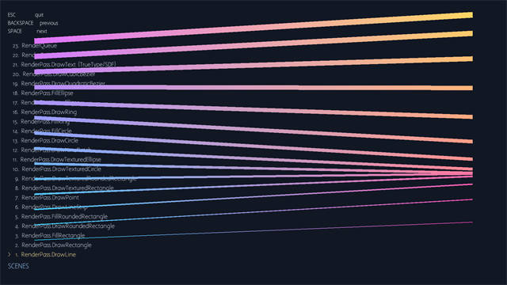](FishGfx/pictures/renderpass-drawline.png) | [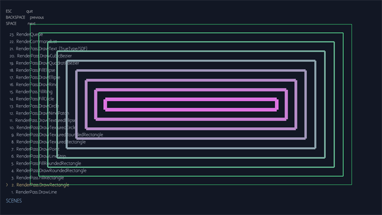](FishGfx/pictures/renderpass-drawrectangle.png) | [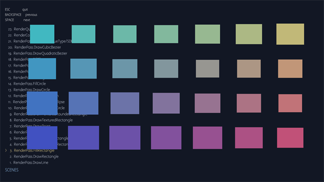](FishGfx/pictures/renderpass-fillrectangle.png) |
| **RenderPass.DrawRoundedRectangle** | **RenderPass.FillRoundedRectangle** | **RenderPass.DrawLineStrip** |
| [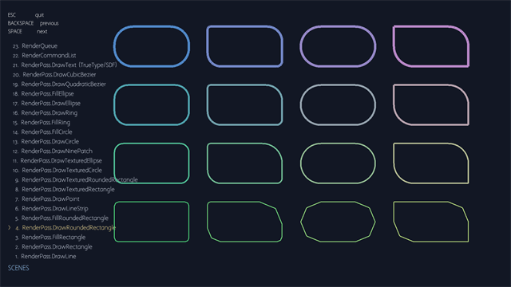](FishGfx/pictures/renderpass-drawroundedrectangle.png) | [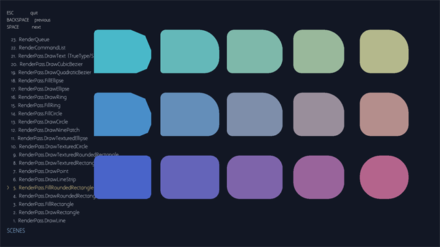](FishGfx/pictures/renderpass-fillroundedrectangle.png) | [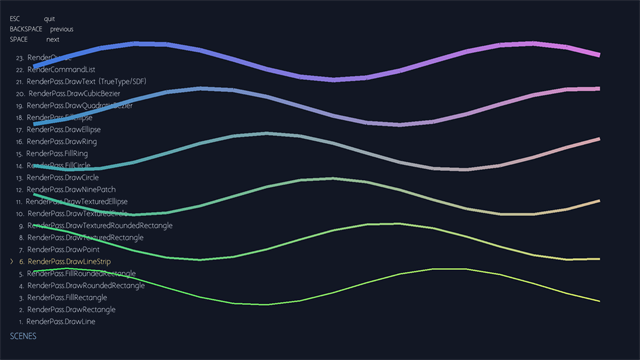](FishGfx/pictures/renderpass-drawlinestrip.png) |
| **RenderPass.DrawPoint** | **RenderPass.DrawTexturedRectangle** | **RenderPass.DrawTexturedRoundedRectangle** |
| [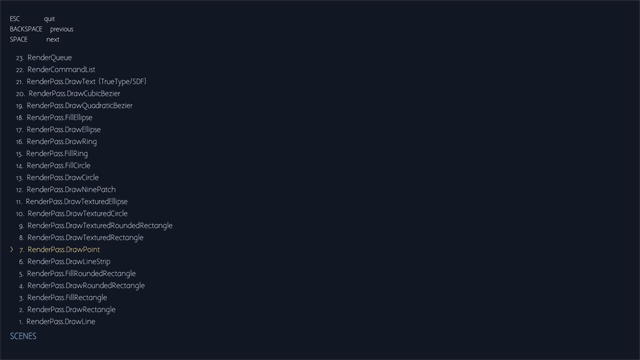](FishGfx/pictures/renderpass-drawpoint.png) | [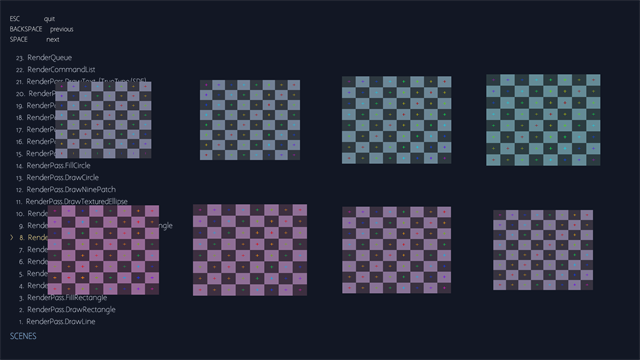](FishGfx/pictures/renderpass-drawtexturedrectangle.png) | [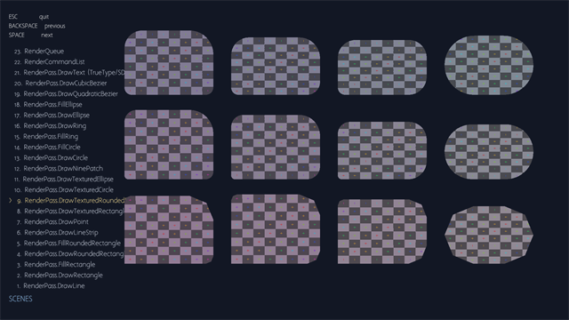](FishGfx/pictures/renderpass-drawtexturedroundedrectangle.png) |
| **RenderPass.DrawTexturedCircle** | **RenderPass.DrawTexturedEllipse** | **RenderPass.DrawNinePatch** |
| [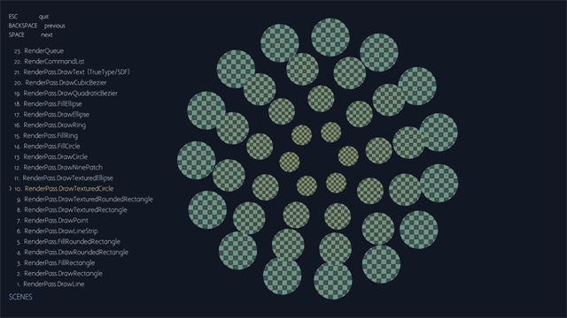](FishGfx/pictures/renderpass-drawtexturedcircle.png) | [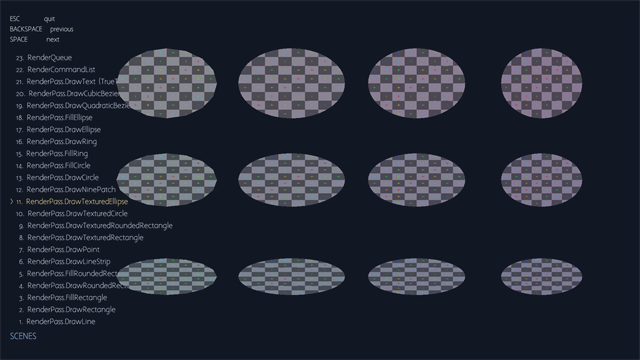](FishGfx/pictures/renderpass-drawtexturedellipse.png) | [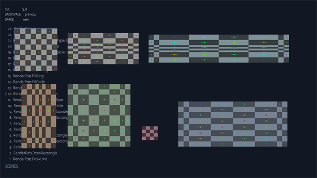](FishGfx/pictures/renderpass-drawninepatch.png) |
| **RenderPass.DrawCircle** | **RenderPass.FillCircle** | **RenderPass.FillRing** |
| [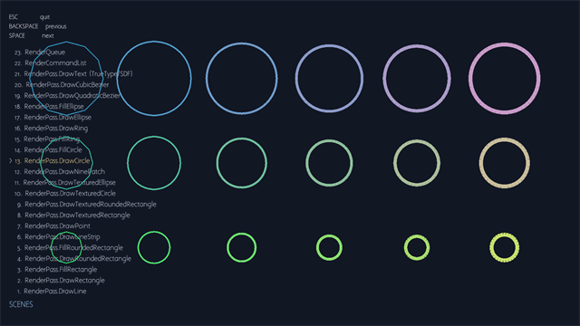](FishGfx/pictures/renderpass-drawcircle.png) | [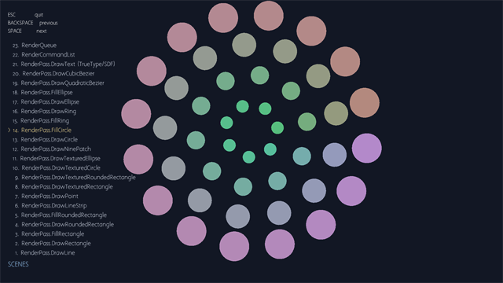](FishGfx/pictures/renderpass-fillcircle.png) | [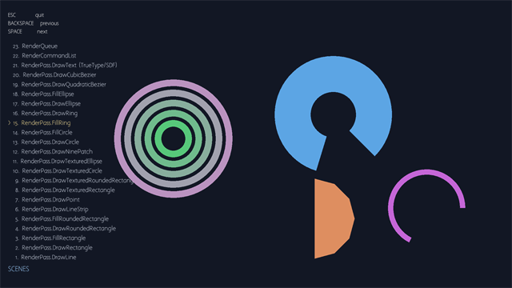](FishGfx/pictures/renderpass-fillring.png) |
| **RenderPass.DrawRing** | **RenderPass.DrawEllipse** | **RenderPass.FillEllipse** |
| [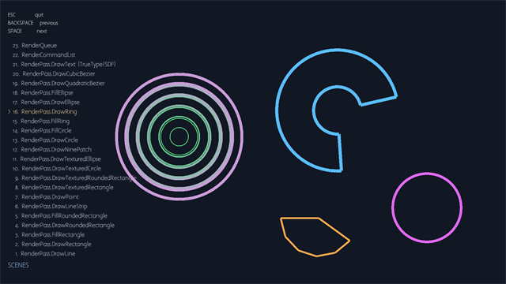](FishGfx/pictures/renderpass-drawring.png) | [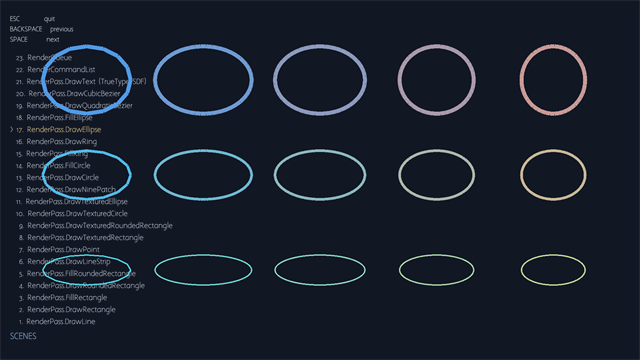](FishGfx/pictures/renderpass-drawellipse.png) | [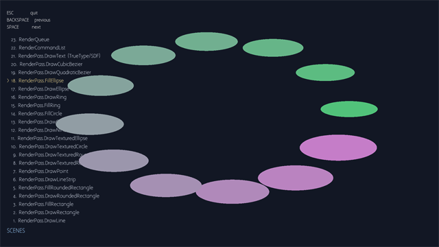](FishGfx/pictures/renderpass-fillellipse.png) |
| **RenderPass.DrawQuadraticBezier** | **RenderPass.DrawCubicBezier** | **RenderPass.DrawText (TrueType/SDF)** |
| [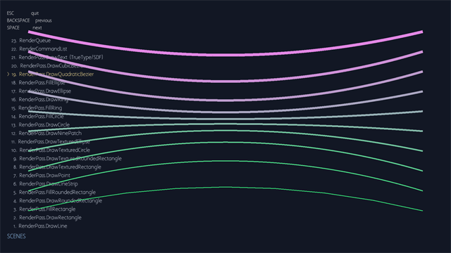](FishGfx/pictures/renderpass-drawquadraticbezier.png) | [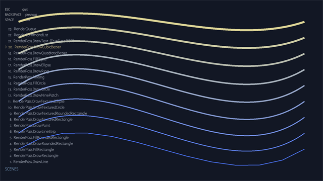](FishGfx/pictures/renderpass-drawcubicbezier.png) | [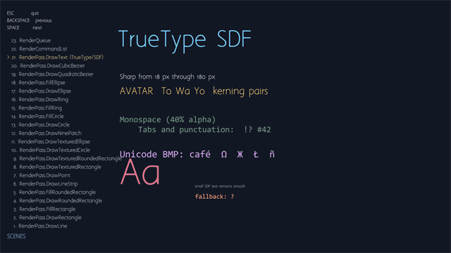](FishGfx/pictures/renderpass-drawtext-truetype-sdf.png) |
| **RenderCommandList** | **RenderQueue** |  |
| [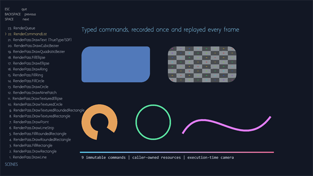](FishGfx/pictures/rendercommandlist.png) | [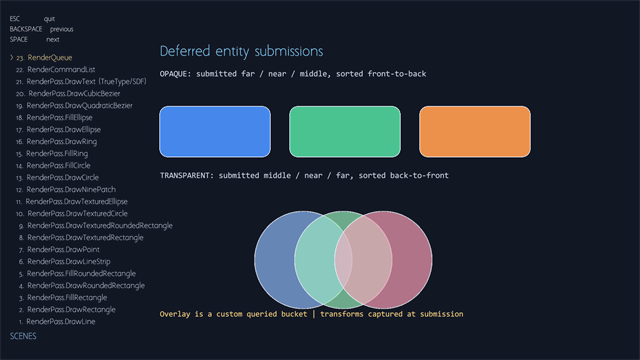](FishGfx/pictures/renderqueue.png) |  |
